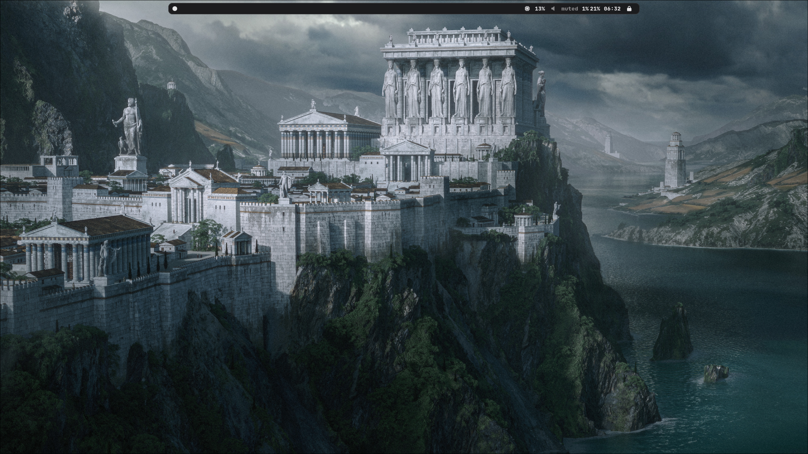
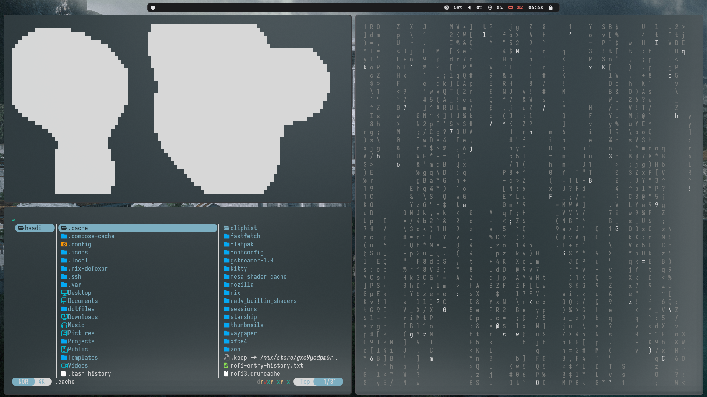
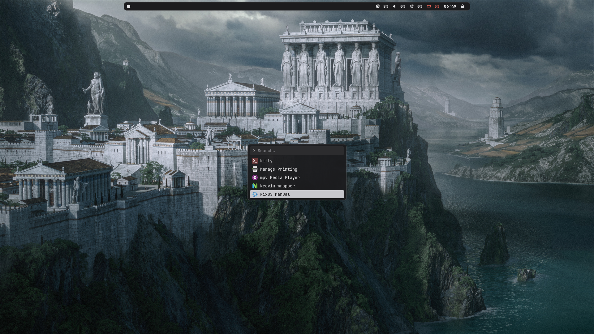

# dotfiles

Personal configs for Mango, Waybar, Rofi, and Kitty. Portable across distros — no Nix required.

## Install

(swap `xbps-install -S` for your distro's package manager — `apt install`, `pacman -S`, etc.)

## Notes

- `mango/config.conf` has a `monitorrule` set for a single `eDP-1` laptop panel — adjust for your display setup.
- `waybar/config.jsonc` targets output `eDP-1` — same deal.
- Each top-level folder is a separate [GNU Stow](https://www.gnu.org/software/stow/) package, so you can symlink only what you want, e.g. `stow waybar rofi` to skip mango.
